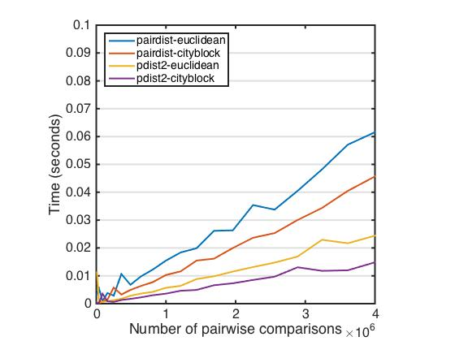

Description
---

This repository contains a custom MATLAB function (`pairdist`) to compute the euclidean or cityblock distance between points in two matrices (`A` and `B`). The user may optionally supply a weights parameter (`WTS`) to differentially weigh the columns of `A` and `B` in the calculation of distance. `WTS` must be a row vector and it ought to sum to 1 (though this not a hard constraint). `A`, `B`, and `WTS` must have the same number of columns.

This function was designed for use in computational models of category learning (such as the *GCM* and *ALCOVE*), and so the aim is to quickly and accurately compute weighted pairwise city-block and euclidean distance.

Usage:
---

    % Matrices to be compared.
    A = [ 1 2
          3 4 ];
    
    B = [ 2 2
          4 3
          1 3 ];
    
    % Compute unweighted cityblock distance
    pairdist(A,B,'cityblock')
    ans =
         1     4     1
         3     2     3

    % Weigh euclidean distance only on column 1
    wts = [1 0];
    pairdist(A,B,'euclidean',wts)
    ans =
         1     3     0
         1     1     2

Accuracy & Efficiency
---
The accuracy of the output of this function has been verified against `pdist2` (from the statistics toolbox). `pdist2` is somewhat more efficient, but this function is nonetheless quite fast, especially compared to the commonly used for-loop and repmat-with-permute methods. `pairdist` is not meaningfully slower that `pdist2` for small to medium-sided datasets (i.e., `A` and `B` each containing <= 200 observations, 40,000 comparisons total).

Here is a figure showing the time taken by each function relative to the number of pairwise distance values computed:

